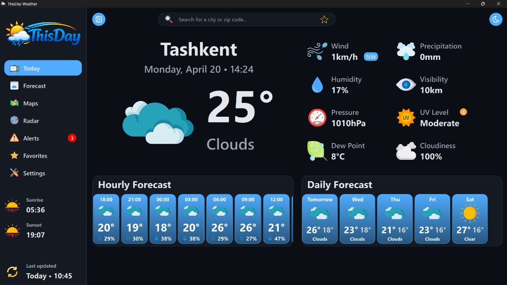
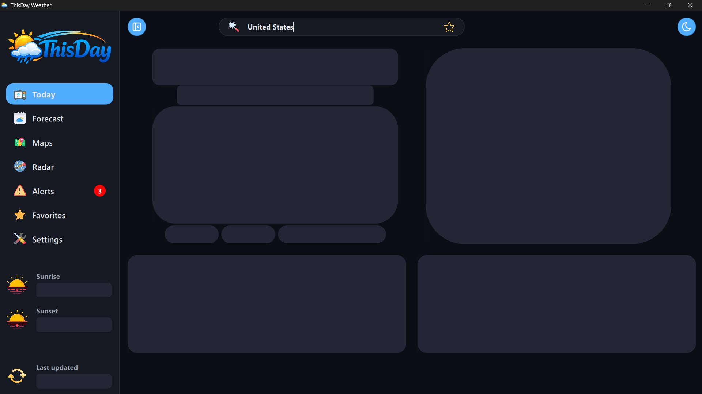
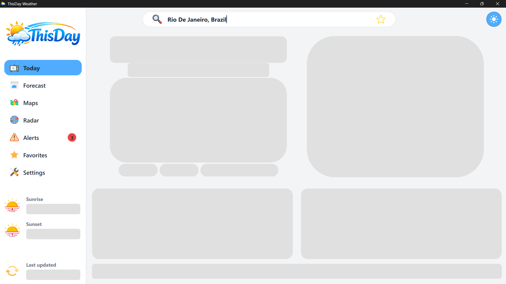
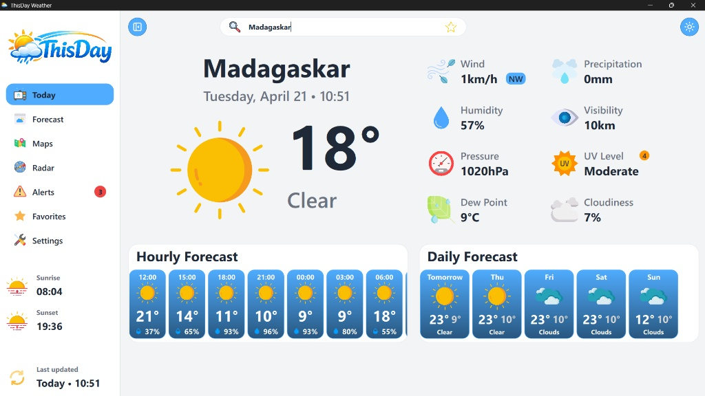

<div align="center">


# 🌤️ ThisDay Weather Engine
### `Cinematic Glassmorphic Dashboard • High-Performance Systems Engineering`

[](https://github.com/iHexedCortex/ThisDay)
[](https://www.qt.io/)
[](https://github.com/iHexedCortex/ThisDay)
[](https://github.com/iHexedCortex/ThisDay)

---



*"Weather data isn't just numbers; it's a narrative. ThisDay interprets atmospheric complexity into human insight."*

</div>

<br />

## 🛰️ Core Philosophy
**ThisDay** is a native desktop engine built to prove that C++ performance and modern "glassmorphic" aesthetics aren't mutually exclusive. By leveraging the **Qt 6 Framework**, it delivers a 60 FPS experience on your Victus hardware while maintaining a zero-latency UI thread through advanced asynchronous polling.

<br />

## 🛠️ The Tech Stack (Engine Room)

| Layer | Technologies | Purpose |
| :--- | :--- | :--- |
| **Frontend** | `QML`, `Qt Quick`, `JavaScript` | Declarative UI & Fluid Animations |
| **Backend** | `C++ 20`, `Qt Network`, `CMake` | Logic, Networking, & Resource Management |
| **Storage** | `JSON Serialization`, `Qt Settings` | Configuration Persistence |
| **API** | `OpenWeatherMap OneCall` | Real-time Global Atmospheric Data |
| **Design** | `Figma`, `Custom SVG Assets` | Visual Identity & Glass Systems |

<br />

## 🖼️ Visual Subsystems

### 🧩 Perceived Performance (Skeleton State)
To eliminate "blank screen fatigue," ThisDay utilizes a custom **Skeleton Loading System**.
<p align="center">
  
  
</p>

### 🌓 Dual-Theme Ecosystem
* **System Core (Dark)**: Optimized for "Cyber-Noir" desktop setups with deep contrast and neon accents.
* **Solar-Optimized (Light)**: High-legibility mode designed for high-glare environments.
<p align="center">
  
  
</p>

<br />

## 🏗️ Architectural Excellence
* **Onion Architecture**: Strict separation between the Core Weather Engine (C++) and the Presentation Layer (QML).
* **Smart Summaries**: Real-time calculated properties (`ComfortLevel`, `ActivityScore`, `AQVibe`) that interpret humidity, UV, and visibility into actionable human insights.
* **Network Heartbeat**: Built-in connectivity monitoring to ensure the "Synced" status indicator is always accurate.

<br />

## 🚀 Fast Start
### Prerequisites
* **Qt 6.6+** (Desktop Development Kit)
* **CMake 3.20+**
* **C++ 20** compatible compiler (MSVC/MinGW)

```bash
# Clone the repository
git clone [https://github.com/iHexedCortex/ThisDay.git](https://github.com/iHexedCortex/ThisDay.git)

# Configure and Build
cd ThisDay
cmake -B build -S .
cmake --build build --config Release
